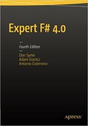

- title : Introduction to F# 
- description : Introduction to F#. Denver Dev Day (May 4, 2018)
- author : Grigoriy Belenkiy
- theme : simple
- transition : convex

***

- data-background : images/20180504DDDWelcome.png
- data-background-transition : none

' Sponsors slide (required by organizators)

***

### Introduction to F#


<small>Grigoriy Belenkiy<br/>
Software developer, S&amp;P Global Market Intelligence
<br/>
<br/>
Denver Dev Day<br/>
May 4, 2018</small>

***

### Imperative vs Functional

---

#### Imperative programming

- Set of statements (sequence of actions)
- Changes in program state (mutable, shared)
- Describes <i>how</i> program operates 
- FORTRAN (1954), OOP - Simula 67 (1960's)

---

#### Functional programming

- Evaluation of mathematical functions
- Avoids mutable state and side-effects
- Output value depends only on input

---

### Functional programming

- Lambda calculus (1930's)
- Math theory of functions and their evaluation
- Basis of almost all functional programming languages today
- $ f(x) = x^{2} + 2 \quad \equiv \quad \lambda x.x^{2} + 2 $

' expressing computation by way of variable binding and substitution

***

#### WTF#?

- ML 
- OCaml
- F#

' Meta-Language 1973 impure multi-paradigm
' GC, imperative construcs (hybrid), type inference (no explicit types annotation)
' OCaml - extended with OO constructs 1996
' F# MS Research 2005, last version 4.1 2017

---

#### Why F#?

- Conciseness
- Convenience
- Correctness
- Concurrency
- Completeness

' Conciseness - no clutter, simple syntax
' Convenience - simpler patterns, hash code, equality methods are autogenerated
' Correctness - powerful type system, type inference, immutability by default, option (remove NRE)
' Concurrency - async model (moved to C#), actor system out of the box
' Completeness - .NET, everything C# can do, libraries reuse, .NET Core - runs on Mac & Linux

***

### Hello World

```fsharp
// using namespace
open System

// entry point attribute for console app
[<EntryPoint>]
// main function
// note: no args type
let main argv =
  printfn "Hello World"
  // ignore function result
  // note: pipe operator - result from the
  // left is passed as the last parameter
  // to the next function
  Console.ReadLine() |> ignore
  // return value, i.e. exit code
  0
```

' let (values binding) / call vs evaluate 
' whitespace significance
' tabs vs spaces - no tabs - no war
' type inference - last expresseion returns - no explicit return (with some exceptions)
' |> - inverts "call-flow" in the source code

***

### FizzBuzz

>Write a program that prints the numbers from 1 to 100. But for multiples of three print “Fizz” instead of the number and for the multiples of five print “Buzz”. For numbers which are multiples of both three and five print “FizzBuzz”.

***

### Factorial

$ {\displaystyle n!= \prod_{k=1}^{n} k} $


$ n! = \begin{cases}
1               & \quad \text{if  } n = 0,\\ 
(n-1)! \times n & \quad \text{if  }n > 0
\end{cases} $

***

### Tail Recursion


***

### FizzBuzz (revisited)

***

### Metric mishap caused loss of NASA orbiter

>(CNN) -- NASA lost a $125 million Mars orbiter because a Lockheed Martin engineering team used English [imperial] units of measurement while the agency's team used the more conventional metric system for a key spacecraft operation, according to a review finding released Thursday.

[CNN.com, September 30, 1999](http://www.cnn.com/TECH/space/9909/30/mars.metric.02/)

---

### Units of Measure

- Float, signed int
- Compile-time checking
- Length, volume, mass, and so on... <span class="fragment"> temperature?</span>

***

### Type providers

- CSV
- SQL
- JSON
- App.config 

***

### Async

***

### Resources

#### On-line

- F# Foundation ([fsharp.org](http://fsharp.org))
- F# For Fun And Profit ([fsharpforfunandprofit.com](http://fsharpforfunandprofit.com))
- Try F# ([tryfsharp.org](http://www.tryfsharp.org))
- F# Cheatsheet ([dungpa.github.io/fsharp-cheatsheet](http://dungpa.github.io/fsharp-cheatsheet/))

---

#### Books

<table>
  <tr>
    <td><a href="http://www.manning.com/petricek/"><br/>
    <small><h4>Real-World Functional Programming With examples in F# and C#</a>
    by Tomas Petricek with Jon Skeet</h4></small></td>
    <td><a href="http://www.manning.com/petricek2/"><br/>
    <small><h4>F# Deep Dives</a>
    edited by Tomas Petricek and Phillip Trelford</h4></small></td>
  </tr>
  <tr>
    <td><a href="https://www.amazon.com/Expert-F-4-0-Don-Syme/dp/1484207416/"><br/>
    <small><h4>Expert F# 4.0</a> by Don Syme‎, Adam Granicz,‎ Antonio Cisternino</h4></small></td>
    <td><a href="https://www.amazon.com/Mastering-F-Alfonso-Garcia-Caro-Nunez/dp/1784393436/"><br/>
    <small><h4>Mastering F#</a> by Alfonso Garcia-Caro Nunez,‎ Suhaib Fahad</h4></small></td>
  </tr>
</table>

***

#### Questions?

[](https://github.com/grishace/ddd-fsharp)<br/>
[https://github.com/grishace/ddd-fsharp](https://github.com/grishace/ddd-fsharp)

***

### May the Fourth be with you!

```fsharp
                  printfn "Star" |>(+)<| "Wars"
```
